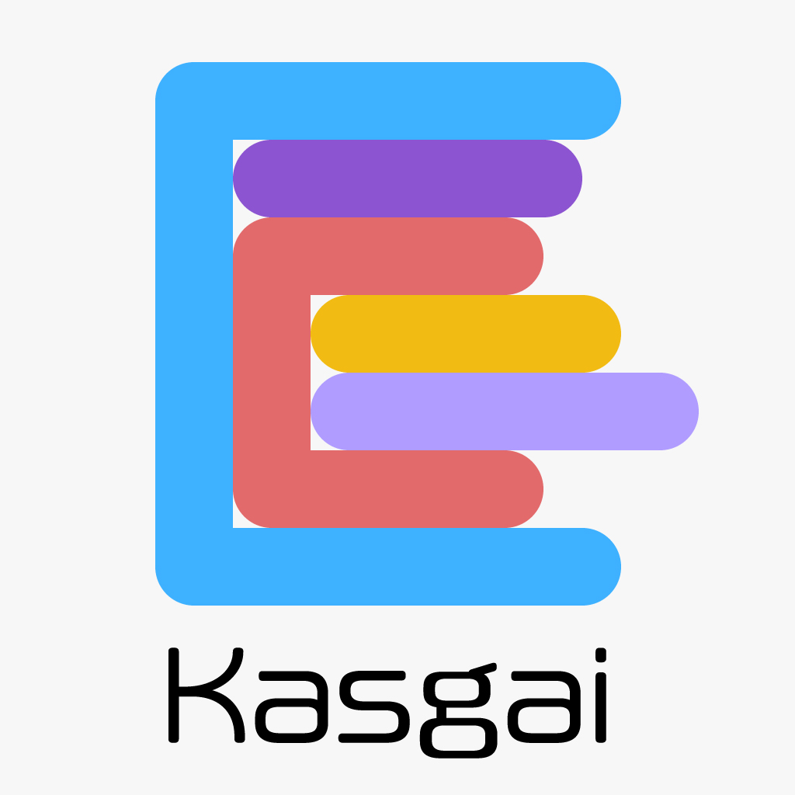

<h1 align="center">Kasgai</h1>
<p align="center">
    
</p>

## About

Kasgai is the educational application for biginner of programming.

## Getting Started

### Project Download

```zsh
git clone https://github.com/Kasgai/kasgai.git
cd kasgai
git submodule update --init --recursive
```

### Firebase CLI Install

[Firebase CLI reference](https://firebase.google.com/docs/cli/)

```zsh
curl -sL https://firebase.tools | bash
```

### Start Kasgai

```
cd hosting
firebase serve
```

Now you can develop Kasgai!

## Application Composition

Kasgai is composed of the following four applications.

- [yattoko](https://github.com/Kasgai/yattoko)
- [kegaki](https://github.com/Kasgai/kegaki)
- [kanna](https://github.com/Kasgai/kanna)
- [shikkui](https://github.com/Kasgai/shikkui)

## Index

- [Kasgai Survey](survey.md) The survey system with CSV import.
